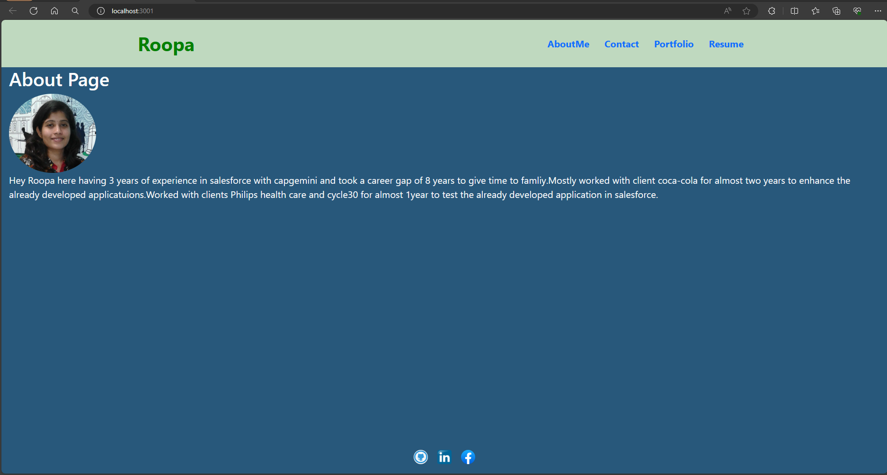
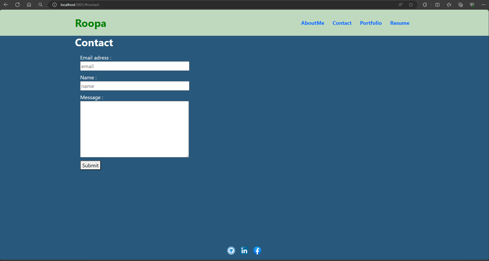
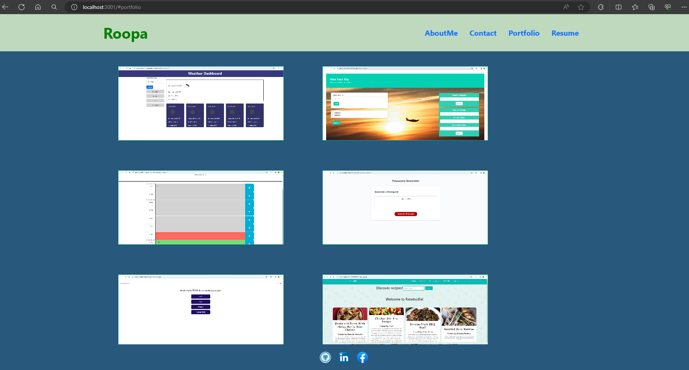
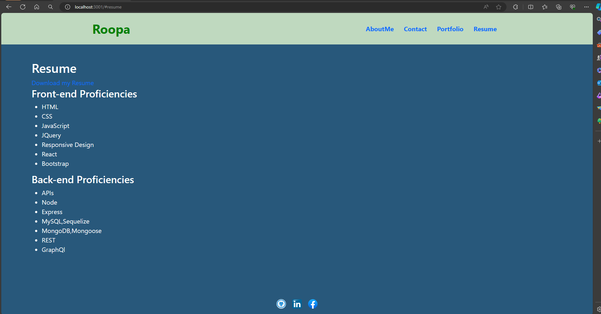

## Description

- Created a single page portfolio website which contains previos experience and current work samples of the employee which makes easier for the employer to get to know about the candiadate skill set and can easily reach to the candidate through the contact info on the site.

-

- Github Repository url: https://github.com/RoopaThimmanacherla/react-portfolio-roopa

- Deployed Application url:

- Desktop view of the deployed application:

## References

- Referred to w3schools and MDN docs for sytax and to the activities in the module which really helped me .Thanks for the instructor for designing the course so well.
